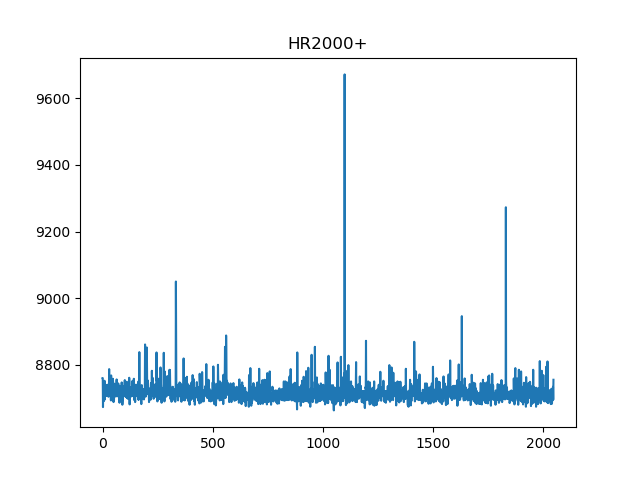

# simple-ocean-optics-spectrometer

**This software is not associated with Ocean Optics. Use it at your own risk**

This Python 3 script (simple_spectrometer.py) was written for those who want
to utilize a basic core or code example for developing their own Ocean
Optics spectrometer interface.

Though it 'claims' support for up to 14 different spectrometer models,
as listed in ocean_optics_configs.py, it has only been tested
with a HR2000+, which was briefly on loan to me. :-(

If you are looking for something more upmarket to get spectra from your
Ocean Optics spectrometer right this minute, then try
[python-seabreeze](https://github.com/ap--/python-seabreeze) which
wraps the [SeaBreeze](http://oceanoptics.com/product/seabreeze/)
library provided by Ocean Optics to communicate with their spectrometers.

If you are using Windows you will need libusb-win32 v1.2.6.0 which can
be found at:
https://sourceforge.net/projects/libusb-win32/files/libusb-win32-releases/1.2.6.0/

I have managed to successfully run this script on Windows 10 using these,
now very old, drivers.

The script also retrieves the following information from the spectrometer:

* Serial Number
* Wavelength Calibration Coefficients
* Stray Light Constant
* Non-Linearity Correlation Coefficients
* Polynomial Order for Non-Linearity Correlation Coefficients
* Grating ID
* Filter Wavelength
* Slit Size
* Array Coating Manufacturer
* Array Range
* L2 Lens Installted
* CPLD Version
* Integration Time

The script is set for an integration time of one second (1,000,000 micro
seconds)

## Notes

When you run simple_spectrometer.py, it automatically searches for
Ocean Optics spectrometers that appear in its list of models, and connects
to and uses the first one it finds.

To quit use CTRL C.

## Further Information

All the USB endpoints, commands, etc. were harvested from Ocean Optics
very useful OEM data sheets, which I strongly suggest you read for your
particular spectrometer before using this code.

Here's a short list of links:

[USB2000+](https://oceanoptics.com/wp-content/uploads/OEM-Data-Sheet-USB2000-.pdf)

[Maya2000 Pro](https://oceanoptics.com/wp-content/uploads/OEM-Data-Sheet-Maya.pdf)

[HR2000](https://oceanoptics.com/wp-content/uploads/OEM-Data-Sheet-HR2000.pdf)

[HR2000+](https://oceanoptics.com/wp-content/uploads/OEM-Data-Sheet-HR2000plus.pdf)

A full list of OEM data sheets is to be found at
[Ocean Optics Technical Documents](https://oceanoptics.com/support/technical-documents/)

## Spectrometers

**Currently working with:**

* HR2000+

**Might work/might not:**

* Maya2000 Pro
* USB2000+
* HR2000
* QE65 Pro
* QE65000
* USB2000
* USB650
* NIRQuest
* Torus
* Apex
* Maya
* Jax
* NIR

## Inspiration

The now closed [python-oceanoptics](https://github.com/ap--/python-oceanoptics) project.
I may have nicked and reworked some stuff from here, viewed in the light of over six years
of working with Ocean Optics spectrometers.
